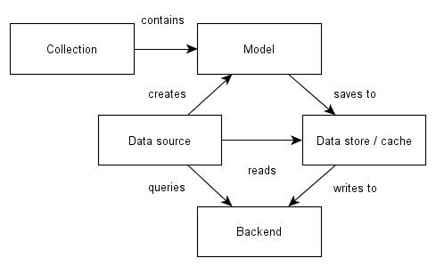

home: index.html
prev: detail1.html
next: collections1.html
---
# 6. The model layer: an overview

Let's examine the model layer in more detail. In the introduction chapter, a model was shown as something that simply queries and writes to storage. The diagram below shows more details of the model layer:

The model layer looks fairly similar across different single page app frameworks because there just aren't that many different ways to solve this problem. You need the ability to represent data items and sets of data items; you need a way to load data; and you probably want to have some caching in place to avoid naively reloading data that you already have. Whether these exist as separate mechanisms or as a part of single large model is mostly an implementation detail.

The major difference is how collections are handled, and this is a result of choices made in the view layer - with observables, you want observable arrays, with events, you want collections.

## Data source

*   Common way of instantiating models from existing data
*   Fetching models by id
*   Fetching models by search

A data source (or backend proxy / API) is responsible for reading from the backend using a simplified and more powerful API. It accepts JSON data, and returns JSON objects that are converted into Models.

Note how the data source reads from the data store/cache, but queries the backend as well. Lookups by ID can be fetched directly from the cache, but more complicated queries need to ask the backend in order to search the full set of data.

## Model

*   A place to store data
*   Emits events when data changes
*   Can be serialized and persisted

The model contains the actual data (attributes) and can be transformed into JSON in order to restore from or save to the backend. A model may have associations, it may have validation rules and it may have subscribers to changes on its data.

## Collection

*   Contains items
*   Emits events when items are added/removed
*   Has a defined item order

Collections exist to make it easy to work with sets of data items. A collection might represent a subset of models, for example, a list of users. Collections are ordered: they represent a particular selection of models for some purpose, usually for drawing a view.

You can implement a collection either:

*   As a model collection that emits events
*   As an observable array of items

The approach you pick is dependent mostly on what kind of view layer you have in mind.

If you think that views should contain their own behavior / logic, then you probably want collections that are aware of models. This is because collections contain models for the purpose of rendering; it makes sense to be able to access models (e.g. via their ID) and tailor some of the functionality for this purpose.

If you think that views should mostly be markup - in other words, that views should not be "components" but rather be "thin bindings" that refer to other things by their name in the global scope - then you will probably prefer observable arrays. In this case, since views don't contain behavior, you will also probably have controllers for storing all the glue code that coordinates multiple views (by referring to them by name).

## Data cache

*   Caches models by id, allowing for faster retrieval
*   Handles saving data to the backend
*   Prevents duplicate instances of the same model from being instantiated

A data store or data cache is used in managing the lifecycle of models, and in saving, updating and deleting the data represented in models. Models may become outdated, they may become unused and they may be preloaded in order to make subsequent data access faster. The difference between a collection and a cache is that the cache is not in any particular order, and the cache represents all the models that the client-side code has loaded and retained.
